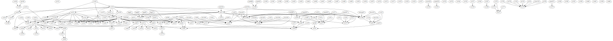

# uw-cse-graph
Very rough graphing of the UW CSE course list

Usage:

```console
pip install beautifulsoup4 graphviz
wget https://www.washington.edu/students/crscat/cse.html
python3 csegraph.py --graphviz cse.html output.gv
```

Sample output:


